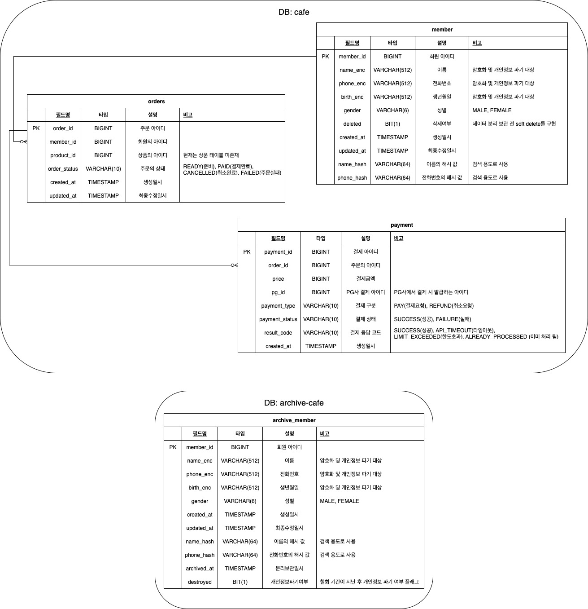

# cafe-api

모바일 카페 주문을 위한 API를 구성하기 위한 샘플 프로젝트입니다.
최대한 실전과 동일하게 암/복호화 및 데이터 분리보관 등을 포함합니다.
> 일부 컴포넌트는 단일 인스턴스 / 메모리를 전제로 구현되어 있습니다.

## 빠른 시작 방법
### 요구 사항
- JDK 17+

**실행**
``` shell
java -jar cafe-api.jar
```

## API 명세
[API 명세](./API.md)를 참조하세요.

## ERD


## 고려했던 부분

### 개인정보 처리

- `CryptoService`: 회원의 데이터를 암/복호화 및 해시하는 서비스, 키를 1분 단위로 변경하고, 이전 키로도 암/복호화가 가능하도록 설계
- **검색을 위한 해시 처리** : 사용자 탈퇴 시 개인정보를 파기해야하므로, 개인정보를 파기해도 VOC 대응을 위한 검색용 해시 데이터를 별도로 보관
- **데이터 분리 보관** : DB를 분리하여 탈퇴 회원의 정보는 분리 보관을 진행하는 시나리오를 보임, batch 작업이나, kafka 등 다른 방법을 선택할수도 있으나, 여기서는 워커를 분리하여 해당 시나리오를 흉내

### 주문 및 결제 처리

- PG사 연도을 가정하여, 일부 확률로 실패 및 한도초과 응답을 주는 클래스를 모킹 
- 타임아웃은 실제로 실패/성공 여부를 알 수 없기 때문에, 후처리하는 별도의 워커로 대응, 또한, 결제시 타임아웃은 워커에서 항상 취소처리를 수행하여, 기존 주문 응답과 동일한 형태로 구현